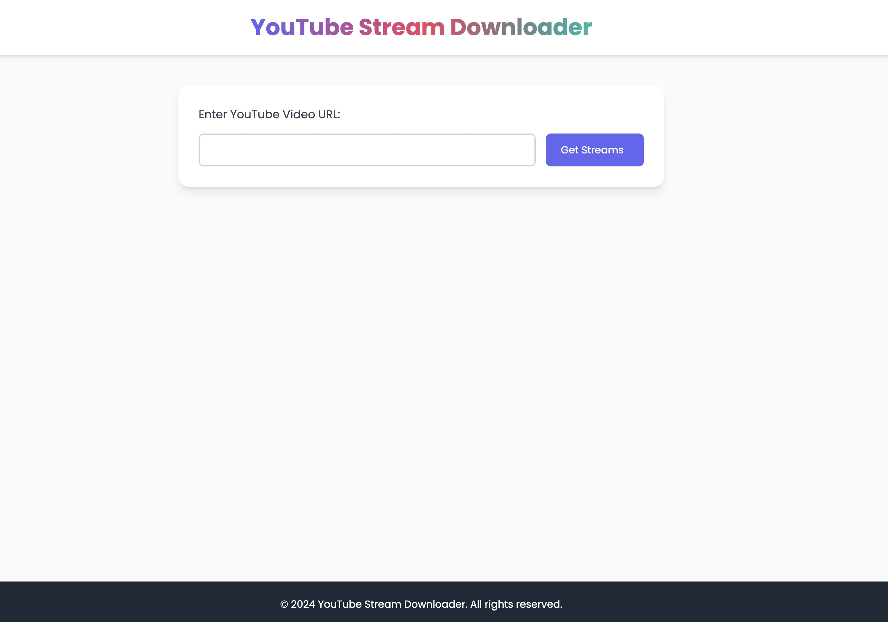
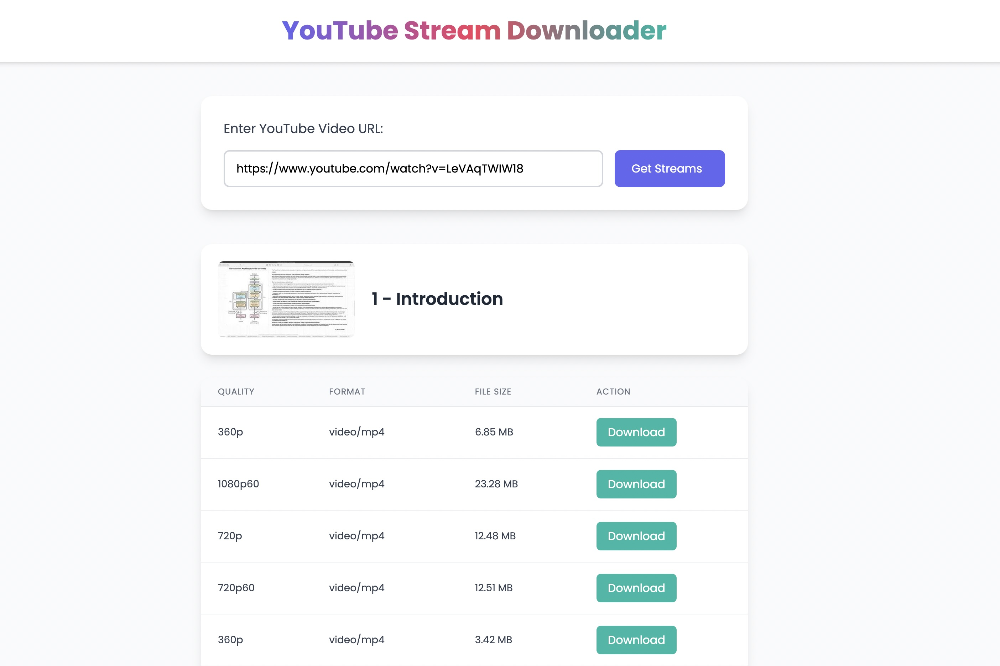

# YouTube Stream Downloader

YouTube Stream Downloader is a web application that allows users to download high-quality YouTube videos in various formats. Built with FastAPI and modern web technologies, this tool provides a fast, easy, and secure way to save YouTube content for offline viewing.



## Deployed Application

You can access the deployed application at:
[https://youtubedownloader-production-e45f.up.railway.app/](https://youtubedownloader-production-e45f.up.railway.app/)

## Features

- Simple and intuitive user interface
- Support for multiple video qualities and formats
- Fast processing and download speeds
- Responsive design for both desktop and mobile devices
- Secure downloading with no ads or pop-ups

## Technologies Used

- Backend: Python 3.8+, FastAPI
- Frontend: HTML5, CSS3 (Tailwind CSS), JavaScript
- Additional libraries: yt-dlp, BeautifulSoup4, Requests

## Installation

1. Create a virtual environment and activate it:
   ```
   python -m venv venv
   source venv/bin/activate  # On Windows, use `venv\Scripts\activate`
   ```

2. Install the required packages:
   ```
   pip install -r requirements.txt
   ```

## Usage

1. Start the FastAPI server:
   ```
   uvicorn main:app --host 0.0.0.0 --port 8000
   ```

2. Open your web browser and navigate to `http://localhost:8000`

3. Enter a YouTube video URL and click "Get Streams" to see available download options.



4. Select your desired quality and format, then click "Download" to save the video.

## API Endpoints

- `GET /`: Serves the main HTML page
- `POST /get_streams`: Retrieves available streams for a given YouTube URL
- `POST /download_stream`: Initiates the download of a selected stream

## Contributing

Contributions are welcome! Please feel free to submit a Pull Request.

## License

This project is licensed under the MIT License - see the [LICENSE](LICENSE) file for details.

## Disclaimer

This tool is for personal use only. Please respect YouTube's terms of service and copyright laws when using this application.